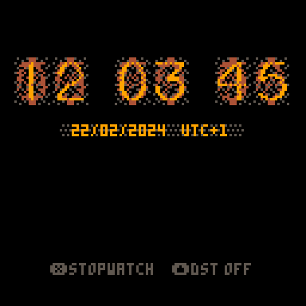
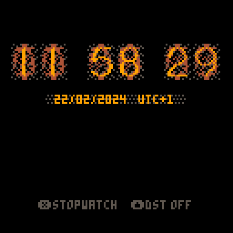
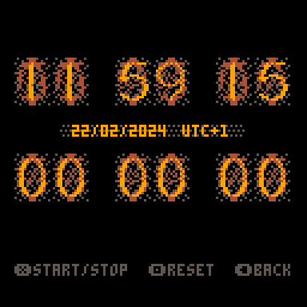

# PICO-8 Retro Clock
A nixie-inspired desktop clock and stopwatch for the PICO-8 fantasy console

This desktop clock shows the time in a pleasant, retro-futuristic way. It shows your current system time and the corresponding offset to UTC, as well as the current date. If you press the ``UP`` button, you can toggle between daylight saving time (DST) or normal time.

Pressing ``X`` will bring up stopwatch mode. You can start and stop the stopwatch by pressing ``X``. Pressing ``X`` again will resume where the stopwatch left off. Pressing ``O`` resets the stopwatch. You can return to the simpler clock-only view by pressing ``LEFT``.

The visuals are based on a nixie clock I own that uses old Soviet IN-16 tubes.

Clock Mode:

Stopwatch Mode:

### To Do List:

* FIXME: Currently the app only works for about 9 hours, before PICO-8's ``time()`` function loops around into the negative and blows everything to hell
* TODO: Port to 60 frames per second
* TODO: Make buttons light up when pressed
* TODO: Sounds?

### Credits:

Idea, art & code: Fabian A. Scherschel

### Release Notes

**v.0.01** (22/02/2024): Initial release